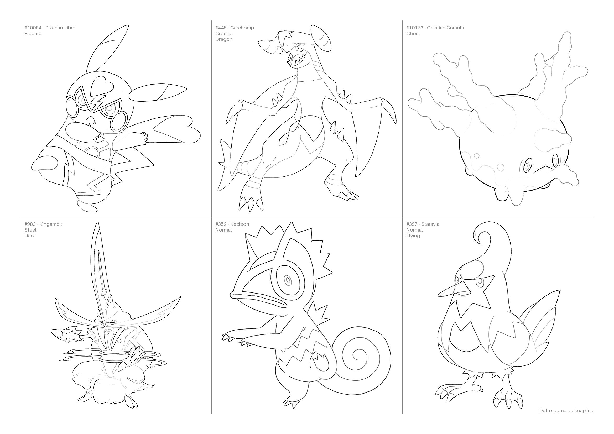

# pokémon-coloring-page
A simple coloring page genrator for Pokémon. Creates a page with multiple Pokémon to color in.

## Data sources
Data is fetched from the [PokéAPI](https://pokeapi.co/).

## Usage
It is recommended to use [uv](https://docs.astral.sh/uv/) for this project. There are other ways to run the project, but they are not documented here.

Use `uvx` to run the app directly from the repository

    uvx --from git+https://github.com/nielsin/pokemon-coloring-page/ pokemon-coloring-page

To install the CLI use `uv tool install`

    uv tool install --from git+https://github.com/nielsin/pokemon-coloring-page/ pokemon-coloring-page

For more information on how to use the CLI, run `pokemon-coloring-page --help` or use the `:help` command inside the CLI app.
